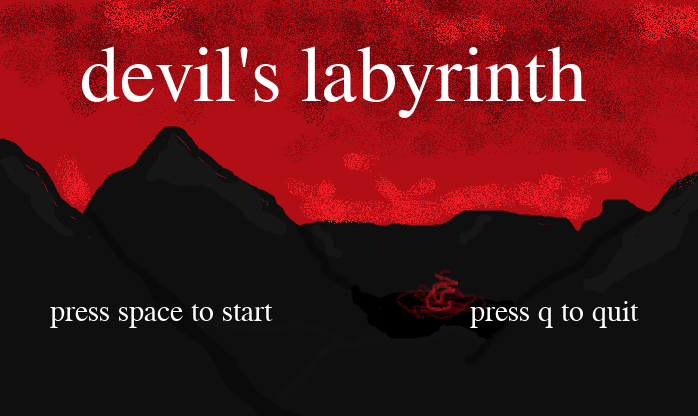
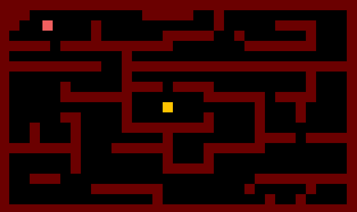
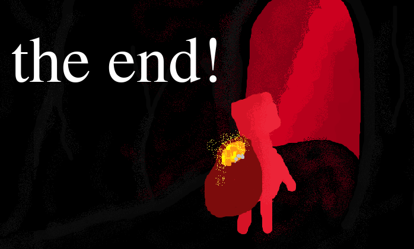

# Pygame Labyrinth Game

This is a simple devil's labyrinth game developed by me as a university project. Its main focuses are learning Python and basics of Pygame.

### Tech Stack

`Python` `Pygame`

### Description

The project is divided into 3 folders:

1. **files** - contains background images, timescores.txt file used to save our time scores and background music (non-copyrighted from free library [pixabay.com](pixabay.com)).
2. **levels** - contains .txt files with 9 maps of levels (like 9 circles of hell).
3. **src** - contains main files of the game, including menu/finish screens, initialization and descriptions of game mechanics. Everything is explained in those files.

### Run the game

To run this game, perform the following in a terminal:

```sh
pip install pygame
python src/main.py
```

### Learnings
- simple algorithms and Python functions
- basics of OOP in Python
- Pygame library
- other Python libraries

### Screenshots


